# Torrent Hunt — System Architecture Documentation

> **Version:** 2.0 (Proposed)
> **Status:** Design Phase
> **Last Updated:** March 2026

---

## Table of Contents

1. [Overview](#1-overview)
2. [Architecture Principles](#2-architecture-principles)
3. [System Layers](#3-system-layers)
   - [3.1 Client Layer](#31-client-layer)
   - [3.2 Edge Layer](#32-edge-layer)
   - [3.3 Identity Layer](#33-identity-layer)
   - [3.4 Application Layer](#34-application-layer)
   - [3.5 Messaging Layer](#35-messaging-layer)
   - [3.6 Cache Layer](#36-cache-layer)
   - [3.7 Persistence Layer](#37-persistence-layer)
   - [3.8 Object Storage Layer](#38-object-storage-layer)
   - [3.9 External Services](#39-external-services)
4. [Service Descriptions](#4-service-descriptions)
   - [4.1 Main API Service](#41-main-api-service)
   - [4.2 Stream Service](#42-stream-service)
   - [4.3 Torrent Worker Pool](#43-torrent-worker-pool)
   - [4.4 Drive Upload Worker](#44-drive-upload-worker)
5. [Data Flow Walkthroughs](#5-data-flow-walkthroughs)
   - [5.1 User Authentication Flow](#51-user-authentication-flow)
   - [5.2 Google Drive Linking Flow](#52-google-drive-linking-flow)
   - [5.3 Torrent Download Flow](#53-torrent-download-flow)
   - [5.4 Real-time Progress Flow](#54-real-time-progress-flow)
   - [5.5 Video Streaming Flow](#55-video-streaming-flow)
6. [API Reference](#6-api-reference)
   - [6.1 Main API Endpoints](#61-main-api-endpoints)
   - [6.2 Stream Service Endpoints](#62-stream-service-endpoints)
   - [6.3 Torrent Worker (Internal)](#63-torrent-worker-internal)
7. [Data Models](#7-data-models)
8. [Infrastructure & Deployment](#8-infrastructure--deployment)
9. [Security Design](#9-security-design)
10. [Performance Considerations](#10-performance-considerations)
11. [Known Limitations & Future Work](#11-known-limitations--future-work)
12. [Service Use Cases](#12-service-use-cases)
    - [12.1 Main API](#121-main-api-main-api--namespace-app)
    - [12.2 Stream Service](#122-stream-service-stream-svc--namespace-app)
    - [12.3 Torrent Worker](#123-torrent-worker-torrent-worker--namespace-workers)
    - [12.4 Drive Upload Worker](#124-drive-upload-worker-drive-worker--namespace-workers)
    - [12.5 Use Case Summary Matrix](#125-use-case-summary-matrix)

---

## 1. Overview

Torrent Hunt is a movie downloader and streaming platform. Users search for movies, initiate downloads via magnet links or `.torrent` files, save downloaded content to their Google Drive, and stream videos directly within the application.

### High-Level Architecture Diagram

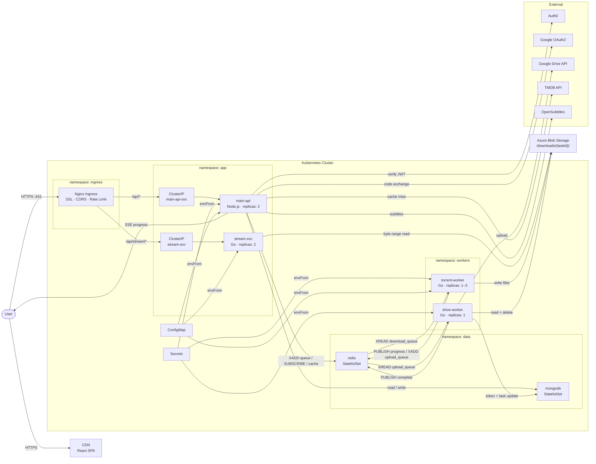

---

## 2. Architecture Principles

| # | Principle | Rationale |
|---|-----------|-----------|
| 1 | **Long-running work never blocks HTTP** | Torrent downloads take minutes to hours. HTTP requests time out in seconds. All download work runs asynchronously via a task queue. |
| 2 | **One service, one concern** | The Main API does not stream video. The Stream Service does not manage auth. The Torrent Worker does not serve HTTP clients directly. |
| 3 | **Object Storage is the shared contract** | Services do not share filesystems or call each other to transfer files. All file I/O goes through a named path in Object Storage. |
| 4 | **Real-time over polling** | Download progress is pushed via Server-Sent Events (SSE) through Redis Pub/Sub. No client polling loops. |
| 5 | **Cache external APIs aggressively** | TMDB rate limits at 40 req/10s. Movie metadata is semi-static. Google Drive tokens are cached with TTL matching token expiry. |
| 6 | **Auth0 Management API is write-once** | Auth0 Management API is only called when the user links their Google Drive. Tokens are stored in MongoDB + cached in Redis for all subsequent reads. |
| 7 | **Security at the edge** | SSL termination, CORS headers, and rate limiting happen at the Nginx gateway. Application services assume internal trusted traffic. |

---

## 3. System Layers

### 3.1 Client Layer

The browser-based React SPA. Responsible exclusively for UI concerns — no business logic.

| Component | Technology | Responsibility |
|-----------|-----------|----------------|
| React App | React 18, TypeScript, Vite | Renders UI, coordinates user interactions |
| Auth0 React SDK | `@auth0/auth0-react` | Handles OIDC login, stores JWT in memory |
| SSE Listener | Native `EventSource` API | Opens one SSE connection per active download; updates progress UI |
| Video Player | HTML5 `<video>` with `Range` support | Issues byte-range HTTP requests to the Stream Service |

**Key Design Decisions:**
- The Google OAuth2 scope (`https://www.googleapis.com/auth/drive.file`) is requested at login so the Drive linking step is frictionless later.
- Auth tokens are never stored in `localStorage`. Auth0 SDK manages them in memory with silent refresh.
- The client never holds Google Drive tokens; it only holds the Auth0 JWT.

---

### 3.2 Edge Layer

All external traffic enters through the Nginx **Ingress Controller** running in the `ingress` namespace. No ClusterIP service or Pod is exposed directly to the internet.

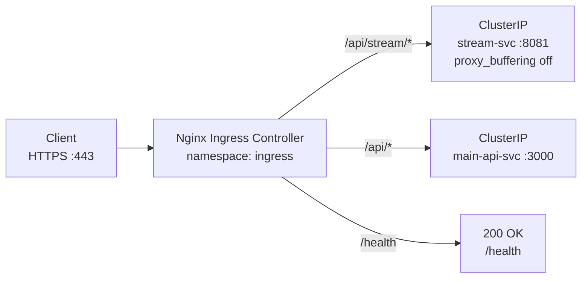

**Nginx responsibilities:**

| Concern | Config |
|---------|--------|
| SSL/TLS termination | `ssl_certificate`, internal services use HTTP |
| CORS headers | `add_header Access-Control-Allow-Origin` |
| Rate limiting | `limit_req_zone` — 20 req/s per IP on `/api/*` |
| Request buffering OFF for streaming | `proxy_buffering off` on `/api/stream/*` |
| Read timeout for SSE | `proxy_read_timeout 3600s` on `/api/tasks/*` |

---

### 3.3 Identity Layer

| Component | Role |
|-----------|------|
| Auth0 Tenant | Issues and verifies JWTs (RS256). All API endpoints validate the `Authorization: Bearer <token>` header against this. |
| Auth0 Management API | Used **once** per user: when they link Google Drive. The resulting access + refresh tokens are stored encrypted in MongoDB. The Management API is never called on the hot request path. |

**Token lifecycle:**

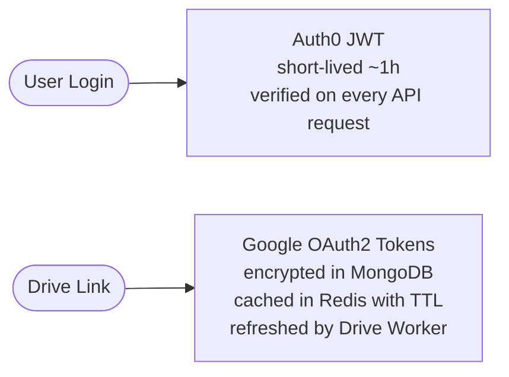

---

### 3.4 Application Layer

Four focused services. No service does more than one job.

#### Responsibility Matrix

| Service | K8s Resource | Namespace | Replicas | Queue? | Storage? |
|---------|-------------|-----------|----------|--------|----------|
| main-api | Deployment + ClusterIP | `app` | 2 | Producer | No |
| stream-svc | Deployment + ClusterIP | `app` | 2 | No | Reader |
| torrent-worker | Deployment | `workers` | 1–3 | Consumer + Producer | Writer |
| drive-worker | Deployment | `workers` | 1 | Consumer | Reader + Deleter |
| redis | StatefulSet | `data` | 1 | — | PVC 5Gi |
| mongodb | StatefulSet | `data` | 1 | — | PVC 20Gi |

---

### 3.5 Messaging Layer

Three Redis primitives drive all async coordination:

| Primitive | Name | Purpose |
|-----------|------|---------|
| Redis Stream | `download_queue` | Task queue for new torrent downloads |
| Redis Stream | `upload_queue` | Task queue for Drive upload after download completes |
| Redis Pub/Sub | `task:{taskId}:progress` | Real-time progress broadcast to SSE subscribers |

**Why Redis Streams over a traditional message broker:**
- Already in the stack for caching — no additional infrastructure
- Consumer groups support `XACK` for at-least-once delivery
- Persistent (unlike plain Pub/Sub) — tasks survive a worker crash
- Sufficient throughput for this use case

---

### 3.6 Cache Layer

All entries in Redis with explicit TTL:

| Key Pattern | Content | TTL |
|-------------|---------|-----|
| `drive_token:{userId}` | Encrypted `{accessToken, refreshToken}` | = Google token expiry |
| `movie:{tmdbId}` | Movie metadata JSON | 1 hour |
| `search:{query_hash}` | TMDB search results array | 15 minutes |
| `task:{taskId}:snapshot` | Last known task status | 24 hours |

---

### 3.7 Persistence Layer

MongoDB with the following collections:

#### `users`
```json
{
  "_id": "auth0|abc123",
  "email": "user@example.com",
  "driveTokens": {
    "encryptedData": "<AES-256-GCM encrypted>",
    "timestamp": "2026-03-29T10:00:00Z",
    "version": "1.0"
  },
  "createdAt": "2026-01-01T00:00:00Z"
}
```

#### `tasks`
```json
{
  "_id": "uuid-v4",
  "userId": "auth0|abc123",
  "magnetLink": "magnet:?xt=urn:btih:...",
  "status": "queued | downloading | uploading | complete | failed",
  "progress": 67.4,
  "speed": "5.2 MB/s",
  "eta": 142,
  "storagePath": "/downloads/uuid-v4/",
  "driveFileId": "1BxiMVs0XRA5nFMdKvBdBZjgmUUqptlbs74OgVE2upms",
  "errorMessage": null,
  "createdAt": "2026-03-29T10:00:00Z",
  "completedAt": null
}
```

#### `movies`
```json
{
  "_id": "tmdb:550",
  "title": "Fight Club",
  "year": 1999,
  "rating": 8.8,
  "posterUrl": "https://image.tmdb.org/...",
  "overview": "...",
  "cachedAt": "2026-03-29T10:00:00Z"
}
```

#### `downloads` (user history)
```json
{
  "_id": "uuid-v4",
  "userId": "auth0|abc123",
  "taskId": "uuid-v4",
  "movieTitle": "Fight Club",
  "driveFileId": "...",
  "sizeBytes": 2147483648,
  "completedAt": "2026-03-29T11:30:00Z"
}
```

---

### 3.8 Object Storage Layer

**Provider:** Azure Blob Storage (production) / MinIO (self-hosted / dev)

**Path convention:**
```
/downloads/{taskId}/{relative-file-path-from-torrent}
```

**Example:**
```
/downloads/a1b2c3d4-e5f6/Fight.Club.1999.mkv
/downloads/a1b2c3d4-e5f6/Subs/Fight.Club.en.srt
```

**Lifecycle rules:**

| Event | Action |
|-------|--------|
| Torrent Worker completes download | Files written to path above |
| Stream Service serves video | Reads from path via byte-range |
| Drive Worker completes upload | Files **deleted** from Object Storage (cost control) |
| Drive Worker fails 3× | Files kept, task marked `failed`, alert raised |
| Files older than 7 days (not yet uploaded) | Container policy auto-deletes |

---

### 3.9 External Services

| Service | Used For | Caching Strategy | Rate Limit Concern |
|---------|---------|----------------|--------------------|
| TMDB / OMDb | Movie metadata, search | Redis 15 min (search), 1h (detail) | 40 req/10s — cache prevents exhaustion |
| OpenSubtitles | Subtitle fetch | Redis 24h per IMDB ID | Low volume, cached on first fetch |
| Google Drive API | File upload destination | N/A (write operation) | Per-user quota, not a bottleneck |
| Google OAuth2 | Token exchange for Drive | Token cached in Redis | N/A |
| Auth0 Tenant | JWT verification (JWKS) | JWKS keys cached in SDK | N/A |
| Auth0 Management API | Store Drive token on link | **Never on hot path** | 2 req/s — only called once per user |

---

## 4. Service Descriptions

### 4.1 Main API Service

**Language:** Node.js + Express + TypeScript  
**Port:** 3000 (internal)  
**Responsibilities:** Authentication enforcement, movie metadata, task lifecycle management, SSE delivery, Drive OAuth callback.

#### Route Groups

```
/movies
  GET  /              → Popular movies (Redis cache → TMDB)
  GET  /search        → Movie search (Redis cache → TMDB)
  GET  /:id           → Movie details (Redis cache → TMDB)

/tasks
  POST  /             → Create download task (push to download_queue)
  GET   /             → List user's tasks (MongoDB)
  GET   /:taskId      → Get single task status (MongoDB)
  GET   /:taskId/progress → SSE stream (Redis Pub/Sub subscriber)
  DELETE /:taskId     → Cancel task

/drive
  POST  /link-google-drive → Exchange OAuth code, store tokens
  GET   /files             → List user Drive files

/subtitles
  GET   /:imdbId       → Fetch subtitles (Redis cache → OpenSubtitles)
```

#### SSE Implementation Pattern

```
GET /tasks/:taskId/progress
  → validate JWT
  → set headers: Content-Type: text/event-stream, Cache-Control: no-cache
  → subscribe to Redis channel: task:{taskId}:progress
  → on message: write "data: {json}\n\n" to response
  → on client disconnect: unsubscribe from Redis
```

---

### 4.2 Stream Service

**Language:** Go + Gin  
**Port:** 8081 (internal)  
**Responsibilities:** Serving video files via HTTP byte-range requests. Nothing else.

#### Why Go for Streaming

Node.js uses a single event loop. Piping 1000 concurrent 5 Mbps streams through it (= 5 Gbps) saturates that loop and degrades all other requests. Go spawns a goroutine per connection — lightweight (4KB stack vs 1MB thread), blocking I/O is fine, and the runtime schedules them efficiently.

#### Byte-range Flow

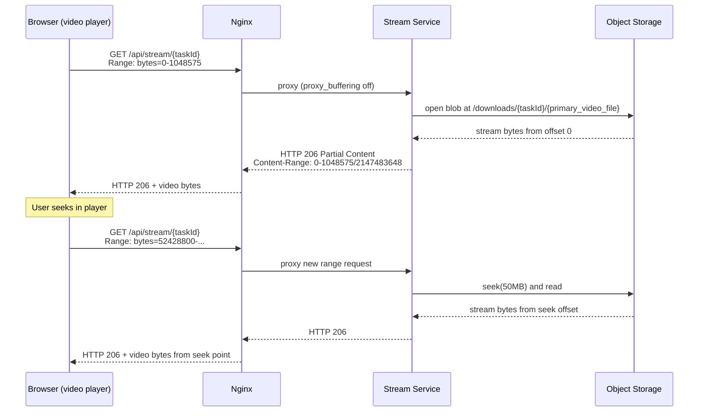

---

### 4.3 Torrent Worker Pool

**Language:** Go  
**Library:** `github.com/anacrolix/torrent`  
**Responsibilities:** Consume tasks from `download_queue`, execute downloads, report progress, write to Object Storage, enqueue upload task.

#### Worker Lifecycle per Task

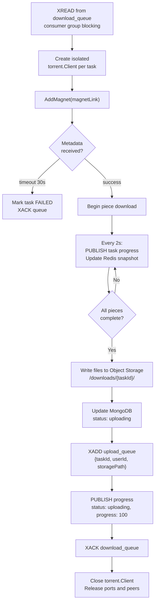

#### Concurrency Control

```go
// Worker pool — limit concurrent downloads to prevent resource exhaustion
const maxConcurrentDownloads = 5

sem := make(chan struct{}, maxConcurrentDownloads)

for task := range downloadQueue {
    sem <- struct{}{}
    go func(t Task) {
        defer func() { <-sem }()
        processDownload(t)
    }(task)
}
```

---

### 4.4 Drive Upload Worker

**Language:** Go  
**Responsibilities:** Consume upload tasks, refresh Google tokens, upload files to user's Google Drive, clean up Object Storage.

#### Upload Lifecycle per Task

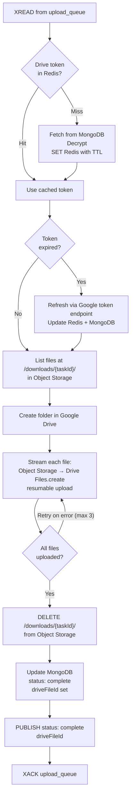

#### Retry Strategy

| Failure | Action |
|---------|--------|
| Token expired | Refresh and retry once |
| Network error on upload | Exponential backoff, max 3 retries |
| Object Storage read error | Mark task `failed`, do not delete files |
| Drive quota exceeded | Mark task `failed`, notify user via SSE |

---

## 5. Data Flow Walkthroughs

### 5.1 User Authentication Flow

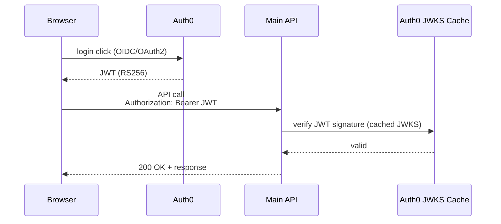

---

### 5.2 Google Drive Linking Flow

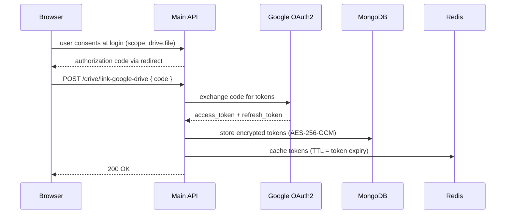

---

### 5.3 Torrent Download Flow

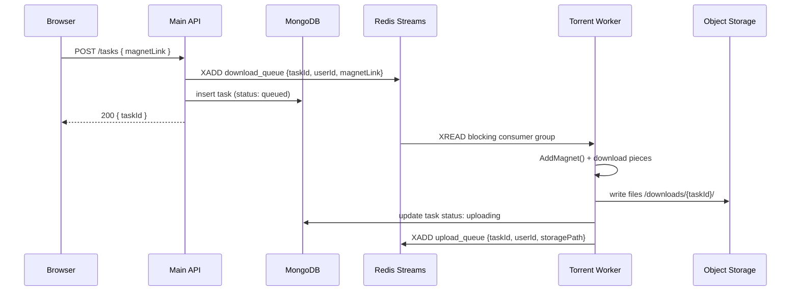

---

### 5.4 Real-time Progress Flow

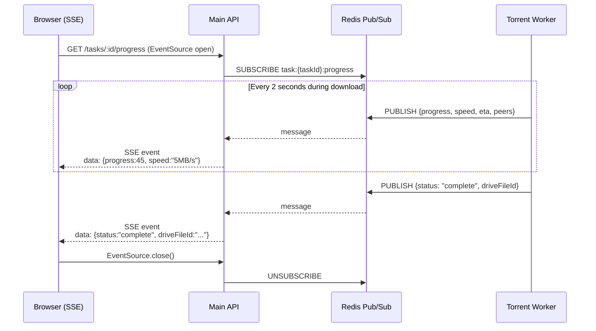

---

### 5.5 Video Streaming Flow

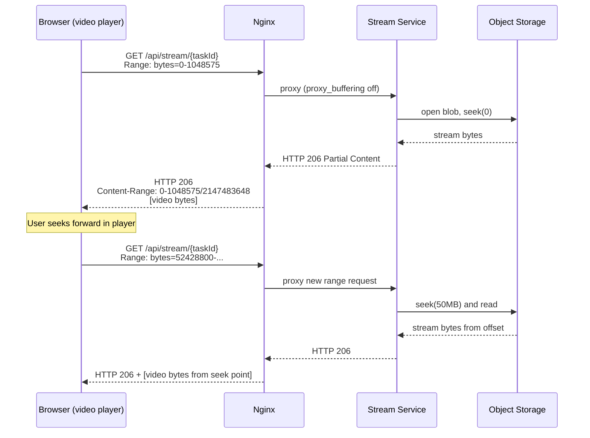

---

## 6. API Reference

### 6.1 Main API Endpoints

All endpoints require `Authorization: Bearer <Auth0 JWT>` unless marked `[public]`.

#### Movies

| Method | Path | Description | Cache |
|--------|------|-------------|-------|
| `GET` | `/movies` | Popular movies list | Redis 1h |
| `GET` | `/movies/search?q={query}` | Search movies | Redis 15min per query hash |
| `GET` | `/movies/:id` | Movie detail by TMDB ID | Redis 1h |

#### Tasks

| Method | Path | Body | Description |
|--------|------|------|-------------|
| `POST` | `/tasks` | `{ magnetLink: string }` | Create download task, returns `{ taskId }` immediately |
| `GET` | `/tasks` | — | List user's tasks (paginated) |
| `GET` | `/tasks/:taskId` | — | Single task status |
| `GET` | `/tasks/:taskId/progress` | — | SSE stream — `Content-Type: text/event-stream` |
| `DELETE` | `/tasks/:taskId` | — | Cancel task (if in progress) |

#### Drive

| Method | Path | Body | Description |
|--------|------|------|-------------|
| `POST` | `/drive/link-google-drive` | `{ code: string }` | Exchange OAuth code, store tokens |
| `GET` | `/drive/files` | — | List user's Drive files (proxy) |

#### Subtitles

| Method | Path | Description |
|--------|------|-------------|
| `GET` | `/subtitles/:imdbId` | Fetch subtitles by IMDB ID |

---

### 6.2 Stream Service Endpoints

| Method | Path | Headers | Description |
|--------|------|---------|-------------|
| `GET` | `/stream/:taskId` | `Range: bytes=X-Y` (optional) | Stream video file. Returns `200` without Range, `206` with Range. |
| `GET` | `/health` | — | Health check |

#### Response Headers

```
HTTP/1.1 206 Partial Content
Content-Type: video/x-matroska
Content-Range: bytes 0-1048575/2147483648
Accept-Ranges: bytes
Content-Length: 1048576
```

---

### 6.3 Torrent Worker (Internal)

No HTTP interface. Communicates exclusively via Redis Streams and Object Storage.

**Input:** Redis Stream `download_queue`
```json
{
  "taskId": "uuid-v4",
  "userId": "auth0|abc123",
  "magnetLink": "magnet:?xt=urn:btih:..."
}
```

**Progress output — Redis Pub/Sub `task:{taskId}:progress`:**
```json
{
  "taskId": "uuid-v4",
  "status": "downloading",
  "progress": 67.4,
  "speed": "5.2 MB/s",
  "eta": 142,
  "peers": 23
}
```

**Completion output — Redis Stream `upload_queue`:**
```json
{
  "taskId": "uuid-v4",
  "userId": "auth0|abc123",
  "storagePath": "/downloads/uuid-v4/"
}
```

---

## 7. Data Models

### Task Status State Machine

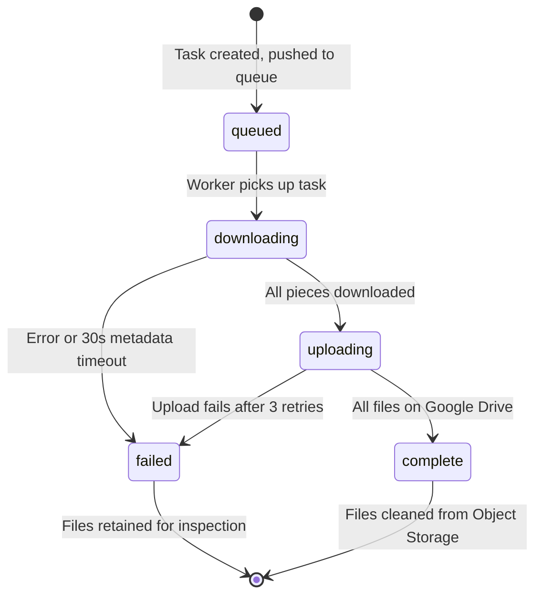

---

## 8. Infrastructure & Deployment

### Kubernetes Resource Summary

| Resource | Kind | Namespace | Replicas | Port |
|----------|------|-----------|----------|------|
| `nginx-ingress` | Deployment | `ingress` | 1 | 80, 443 |
| `main-api` | Deployment | `app` | 2 | 3000 |
| `main-api-svc` | ClusterIP Service | `app` | — | 3000 |
| `stream-svc` | Deployment | `app` | 2 | 8081 |
| `stream-svc-svc` | ClusterIP Service | `app` | — | 8081 |
| `torrent-worker` | Deployment | `workers` | 1–3 | — |
| `drive-worker` | Deployment | `workers` | 1 | — |
| `redis` | StatefulSet | `data` | 1 | 6379 |
| `mongodb` | StatefulSet | `data` | 1 | 27017 |
| `redis-data` | PersistentVolumeClaim | `data` | — | 5Gi |
| `mongo-data` | PersistentVolumeClaim | `data` | — | 20Gi |
| `app-secrets` | Secret | cluster-wide | — | — |
| `app-config` | ConfigMap | cluster-wide | — | — |

### Namespace Layout

```
k8s/
├── namespace: ingress
│   └── nginx ingress controller
├── namespace: app
│   ├── main-api (Deployment + ClusterIP)
│   └── stream-svc (Deployment + ClusterIP)
├── namespace: workers
│   ├── torrent-worker (Deployment)
│   └── drive-worker (Deployment)
└── namespace: data
    ├── redis (StatefulSet + PVC 5Gi)
    └── mongodb (StatefulSet + PVC 20Gi)
```

### Sample Kubernetes Manifests

#### Deployment — `main-api`
```yaml
apiVersion: apps/v1
kind: Deployment
metadata:
  name: main-api
  namespace: app
spec:
  replicas: 2
  selector:
    matchLabels:
      app: main-api
  template:
    metadata:
      labels:
        app: main-api
    spec:
      containers:
        - name: main-api
          image: torrent-hunt/main-api:latest
          ports:
            - containerPort: 3000
          envFrom:
            - configMapRef:
                name: app-config
            - secretRef:
                name: app-secrets
```

#### ClusterIP Service — `main-api-svc`
```yaml
apiVersion: v1
kind: Service
metadata:
  name: main-api-svc
  namespace: app
spec:
  type: ClusterIP
  selector:
    app: main-api
  ports:
    - port: 3000
      targetPort: 3000
```

#### Ingress
```yaml
apiVersion: networking.k8s.io/v1
kind: Ingress
metadata:
  name: torrent-hunt-ingress
  namespace: ingress
  annotations:
    nginx.ingress.kubernetes.io/proxy-buffering: "off"
    nginx.ingress.kubernetes.io/proxy-read-timeout: "3600"
spec:
  rules:
    - http:
        paths:
          - path: /api/stream
            pathType: Prefix
            backend:
              service:
                name: stream-svc-svc
                port:
                  number: 8081
          - path: /api
            pathType: Prefix
            backend:
              service:
                name: main-api-svc
                port:
                  number: 3000
```

#### StatefulSet — `redis`
```yaml
apiVersion: apps/v1
kind: StatefulSet
metadata:
  name: redis
  namespace: data
spec:
  replicas: 1
  serviceName: redis
  selector:
    matchLabels:
      app: redis
  template:
    metadata:
      labels:
        app: redis
    spec:
      containers:
        - name: redis
          image: redis:7-alpine
          ports:
            - containerPort: 6379
          volumeMounts:
            - name: redis-data
              mountPath: /data
  volumeClaimTemplates:
    - metadata:
        name: redis-data
      spec:
        accessModes: ["ReadWriteOnce"]
        resources:
          requests:
            storage: 5Gi
```

### Local Development (Docker Compose)

```yaml
services:
  nginx:
    image: nginx:alpine
    ports: ["443:443", "80:80"]

  main-api:
    build: ./backend/main-service
    environment:
      - REDIS_URL=redis://redis:6379
      - MONGODB_URI=mongodb://mongo:27017/torrent-hunt
      - AUTH0_DOMAIN=${AUTH0_DOMAIN}
      - AUTH0_AUDIENCE=${AUTH0_AUDIENCE}

  stream-service:
    build: ./backend/stream-service
    environment:
      - OBJECT_STORAGE_URL=http://minio:9000

  torrent-worker:
    build: ./backend/torrent-service
    environment:
      - REDIS_URL=redis://redis:6379
      - OBJECT_STORAGE_URL=http://minio:9000

  drive-worker:
    build: ./backend/drive-worker
    environment:
      - REDIS_URL=redis://redis:6379
      - MONGODB_URI=mongodb://mongo:27017/torrent-hunt
      - OBJECT_STORAGE_URL=http://minio:9000

  redis:
    image: redis:7-alpine
    volumes: [redis-data:/data]

  mongo:
    image: mongo:7
    volumes: [mongo-data:/data/db]

  minio:
    image: minio/minio
    command: server /data --console-address ":9001"
    volumes: [minio-data:/data]
```

### Environment Variables

#### Main API (`/backend/main-service/.env`)
```env
AUTH0_DOMAIN=
AUTH0_AUDIENCE=
AUTH0_MGMT_CLIENT_ID=
AUTH0_MGMT_CLIENT_SECRET=
GOOGLE_CLIENT_ID=
GOOGLE_CLIENT_SECRET=
GOOGLE_REDIRECT_URI=
MONGODB_URI=
REDIS_URL=
TMDB_API_KEY=
OPENSUBTITLES_API_KEY=
ENCRYPTION_KEY=
```

#### Torrent Worker (`/backend/torrent-service/.env`)
```env
REDIS_URL=
OBJECT_STORAGE_URL=
OBJECT_STORAGE_ACCOUNT=
OBJECT_STORAGE_KEY=
MAX_CONCURRENT_DOWNLOADS=5
```

#### Client (`/client/.env`)
```env
VITE_AUTH0_DOMAIN=
VITE_AUTH0_CLIENT_ID=
VITE_AUTH0_CALLBACK_URL=
VITE_AUTH_IDENTIFIER=
VITE_GOOGLE_CLIENT_ID=
VITE_API_BASE_URL=
VITE_APP_ENVIRONMENT=development
```

---

## 9. Security Design

### Authentication & Authorization

| Layer | Mechanism |
|-------|-----------|
| Client → API Gateway | HTTPS (TLS 1.3) |
| JWT validation | Auth0 RS256, verified on every Main API request |
| Internal services | No auth (trusted network, VNet/Docker network) |
| Object Storage | Service principle / SAS tokens (not user-facing) |
| Drive tokens | AES-256-GCM encrypted at rest in MongoDB |

### Threat Model

| Threat | Mitigation |
|--------|-----------|
| Unauthorized torrent start | JWT required on `POST /tasks`; internal queue not exposed |
| Drive token theft | Never returned to client; encrypted in DB; short Redis TTL |
| Magnet link injection | Input validation + length limit on `magnetLink` field |
| Excessive downloads (abuse) | Rate limiting at Nginx + per-user task count limit in Main API |
| DDoS on stream endpoint | Nginx `limit_req`, Nginx `limit_conn` per IP |
| Open Torrent Worker port | Worker has no HTTP server; not reachable externally |
| Auth0 Management API abuse | Only called on Drive link; not accessible from client |

### Data at Rest

- MongoDB drive tokens: AES-256-GCM + HMAC authentication
- Redis drive token cache: same encrypted blob — Redis itself is on a private VNet
- Object Storage: Azure Blob private access — no public URLs
- Video streaming: URL includes `taskId` (UUID) — not guessable; future work: add HMAC-signed URLs

---

## 10. Performance Considerations

### Throughput Estimates

| Scenario | Load | Expected Behavior |
|----------|------|------------------|
| 100 concurrent movie searches | 100 req/s on `/movies/search` | Served from Redis cache — <5ms per response |
| 50 concurrent active downloads | 50 tasks in Go worker pool | 5 workers active, 45 queued in Redis Stream |
| 500 concurrent video streams | 500 byte-range requests | 500 goroutines in Stream Service — Go handles natively |
| 200 concurrent SSE connections | 200 Redis Pub/Sub subscribers in Main API | Node.js event-loop handles SSE efficiently (I/O not CPU) |

### Bottleneck Analysis (Post-Fix)

| Previous Bottleneck | Solution Applied | Result |
|--------------------|-----------------|--------|
| HTTP handler blocking on download | Async via Redis Stream queue | HTTP returns in <100ms |
| Polling every 2s per client | SSE + Redis Pub/Sub push | Zero polling, one persistent connection |
| Auth0 Management API per request | Redis token cache + MongoDB | Token reads in <1ms (Redis hit) |
| Node.js streaming 1000 videos | Dedicated Go Stream Service | 1000 goroutines, ~4KB each = 4MB overhead |
| Services sharing `/root/temp` | Object Storage shared layer | Services are fully decoupled |
| Hardcoded task ID | UUID v4 per task | Correct isolation per user/task |

---

## 12. Service Use Cases

Use cases are grouped by service and prefixed with short codes: `MA` (main-api), `SS` (stream-svc), `TW` (torrent-worker), `DW` (drive-worker). Each use case follows the format: **Actor → Trigger → Preconditions → Main Flow → Extensions → Postconditions**.

---

### 12.1 Main API (`main-api` · namespace: `app`)

---

#### UC-MA-01 — Authenticate an API Request

| Field | Detail |
|-------|--------|
| **Actor** | Any authenticated user |
| **Trigger** | HTTP request arrives at any protected route |
| **Preconditions** | Auth0 tenant is reachable; JWKS keys are cached (or cacheable) |

**Main Flow**
1. Nginx Ingress forwards request to `main-api-svc` (ClusterIP), including `Authorization: Bearer <JWT>`.
2. `authMiddleware` calls `express-oauth2-jwt-bearer` to verify JWT signature against cached JWKS.
3. Middleware extracts `sub` (Auth0 user ID) and attaches it to `req.auth`.
4. Request proceeds to the route handler.

**Extensions**
- `2a` — JWT is expired → return `401 Unauthorized { code: "token_expired" }`.
- `2b` — JWKS fetch fails → return `503 Service Unavailable`; SDK retries from cache.
- `2c` — JWT audience/issuer mismatch → return `401 Unauthorized { code: "invalid_claims" }`.

**Postconditions** — `req.auth.sub` is set; downstream handlers can identify the caller.

---

#### UC-MA-02 — Search Movies

| Field | Detail |
|-------|--------|
| **Actor** | Authenticated user |
| **Trigger** | `GET /movies/search?q=<title>` |
| **Preconditions** | User is authenticated; TMDB API key is present in `app-secrets` |

**Main Flow**
1. `authMiddleware` validates JWT (UC-MA-01).
2. `movieController` reads `q` query param; validates non-empty (max 100 chars).
3. Checks Redis key `search:{md5(q)}` with TTL 15 min.
4. **Cache hit** → return cached JSON immediately.
5. **Cache miss** → call TMDB `/search/movie?query=q`.
6. Transform TMDB response to internal `Movie` shape; write to Redis.
7. Return `200 { results: Movie[] }`.

**Extensions**
- `2a` — `q` missing or blank → `400 Bad Request`.
- `5a` — TMDB returns non-200 → log error, return `502 Bad Gateway`.
- `5b` — TMDB returns empty results → return `200 { results: [] }`.

**Postconditions** — Movie list is in Redis; client receives results.

---

#### UC-MA-03 — Create a Download Task

| Field | Detail |
|-------|--------|
| **Actor** | Authenticated user |
| **Trigger** | `POST /tasks { magnetLink }` |
| **Preconditions** | User is authenticated; Redis `download_queue` stream exists; MongoDB is reachable |

**Main Flow**
1. JWT validated (UC-MA-01).
2. `validationMiddleware` checks `magnetLink` matches `magnet:?xt=urn:btih:` pattern and is ≤ 1024 chars.
3. Generate `taskId = uuid.v4()`.
4. `XADD download_queue * taskId <id> userId <sub> magnetLink <link>`.
5. MongoDB insert: `{ _id: taskId, userId: sub, magnetLink, status: "queued", progress: 0, createdAt: now }`.
6. Return `201 { taskId }`.

**Extensions**
- `2a` — Invalid magnet URI → `400 Bad Request { field: "magnetLink" }`.
- `4a` — Redis unreachable → `503 Service Unavailable`; task not created (no partial state).
- `5a` — MongoDB write fails after Redis enqueue → log critical; attempt Redis `XDEL` for rollback; return `500`.

**Postconditions** — Task document in MongoDB with `status: queued`; message on `download_queue`.

---

#### UC-MA-04 — Subscribe to Task Progress via SSE

| Field | Detail |
|-------|--------|
| **Actor** | Authenticated user's browser |
| **Trigger** | `GET /tasks/:taskId/progress` |
| **Preconditions** | Task exists and belongs to the requesting user; Redis Pub/Sub is reachable |

**Main Flow**
1. JWT validated (UC-MA-01).
2. Verify `taskId` exists in MongoDB and `userId` matches `req.auth.sub` → `403` if not.
3. Set response headers: `Content-Type: text/event-stream`, `Cache-Control: no-cache`, `X-Accel-Buffering: no`.
4. Subscribe to Redis channel `task:{taskId}:progress`.
5. On each Redis message: write `data: <json>\n\n` to the HTTP response.
6. Send a heartbeat `data: {"type":"ping"}\n\n` every 15 s to prevent proxy timeouts.
7. On client disconnect (`res.on("close")`): unsubscribe from Redis channel; end response.

**Extensions**
- `2a` — Task not found → `404 Not Found`.
- `2b` — Task belongs to different user → `403 Forbidden`.
- `4a` — Redis subscription fails → `503`; client should retry with exponential back-off.
- `5a` — Task already `complete` or `failed` before client connects → emit last stored snapshot from Redis then close.

**Postconditions** — Long-lived HTTP connection open; events forwarded to client until disconnect or task completion.

---

#### UC-MA-05 — Link Google Drive Account

| Field | Detail |
|-------|--------|
| **Actor** | Authenticated user |
| **Trigger** | `POST /drive/link-google-drive { code }` |
| **Preconditions** | Auth0 login requested `google-oauth2` connection with `drive.file` scope; user has an authorization `code` |

**Main Flow**
1. JWT validated (UC-MA-01).
2. `googleDrive.ts` calls Google token endpoint: exchange `code` for `{ access_token, refresh_token, expiry_date }`.
3. Encrypt both tokens with AES-256-GCM using `ENCRYPTION_KEY` from `app-secrets`.
4. MongoDB upsert on `users` collection: set `driveTokens: { encrypted }`, `driveLinked: true`.
5. Cache plain tokens in Redis key `drive:token:{userId}` with TTL = `expiry_date - now`.
6. Return `200 { driveLinked: true }`.

**Extensions**
- `2a` — Google returns `invalid_grant` → `400 { code: "invalid_code" }`.  
- `2b` — No `refresh_token` in response (user already granted previously) → proceed with `access_token` only; log warning.
- `4a` — MongoDB write fails → `500`; tokens are not stored; user sees failure and retries.

**Postconditions** — Drive tokens stored encrypted in MongoDB and plaintext in Redis; user may now start tasks that will auto-upload.

---

#### UC-MA-06 — Cancel a Download Task

| Field | Detail |
|-------|--------|
| **Actor** | Authenticated user |
| **Trigger** | `DELETE /tasks/:taskId` |
| **Preconditions** | Task exists and is in `queued` or `downloading` state |

**Main Flow**
1. JWT validated (UC-MA-01).
2. Load task from MongoDB; verify ownership.
3. If `status === "queued"`: update MongoDB `status: cancelled`; attempt `XDEL download_queue <entryId>` if entry still pending.
4. If `status === "downloading"`: publish `PUBLISH task:{taskId}:control "cancel"` to Redis; worker subscribes to this channel and will abort.
5. Update MongoDB `status: cancelled`.
6. Return `200 { cancelled: true }`.

**Extensions**
- `3a` — Task is `uploading` or `complete` → `409 Conflict { message: "Cannot cancel after upload started" }`.
- `4a` — Worker already completed before cancel signal arrives → no-op; return `200` anyway.

**Postconditions** — Task marked `cancelled`; worker aborts if mid-download; Object Storage cleanup handled by a scheduled purge job.

---

### 12.2 Stream Service (`stream-svc` · namespace: `app`)

---

#### UC-SS-01 — Serve a Video File with Byte-Range

| Field | Detail |
|-------|--------|
| **Actor** | Browser video player |
| **Trigger** | `GET /api/stream/:taskId` with `Range: bytes=<start>-<end>` header |
| **Preconditions** | Task status is `complete` or `uploading` (file exists in Object Storage); Nginx Ingress has `proxy_buffering off` |

**Main Flow**
1. `stream-svc` receives request proxied by Ingress (no JWT check — Ingress ensures route is only reachable for valid sessions at edge).
2. Construct Object Storage path: `/downloads/{taskId}/<primary_video_file>` (largest `.mkv`/`.mp4` in the blob prefix).
3. Parse `Range` header → `start`, `end`, `total`.
4. Open a ranged read stream from Object Storage at `(start, end)`.
5. Respond with `206 Partial Content`, headers: `Content-Range: bytes <start>-<end>/<total>`, `Accept-Ranges: bytes`, `Content-Type: video/mp4`.
6. Pipe blob bytes directly to HTTP response — no buffering.

**Extensions**
- `2a` — No file found at path → `404 Not Found`.
- `3a` — `Range` header absent → return full file with `200 OK` (browser compatibility).
- `3b` — Range is unsatisfiable (`start > total`) → `416 Range Not Satisfiable`.
- `4a` — Object Storage read error mid-stream → close connection; client video player will retry the range.

**Postconditions** — Video bytes delivered to browser; video resumes/plays smoothly.

---

#### UC-SS-02 — Handle Video Seek

| Field | Detail |
|-------|--------|
| **Actor** | Browser video player after user drags seek bar |
| **Trigger** | New `GET /api/stream/:taskId` with updated `Range: bytes=<newOffset>-` |
| **Preconditions** | An active stream (UC-SS-01) may or may not be in progress |

**Main Flow**
1. Browser cancels the previous HTTP connection and opens a new ranged request.
2. `stream-svc` opens a new ranged read directly at `newOffset` (Object Storage supports arbitrary seeks).
3. Returns `206 Partial Content` from `newOffset`.
4. Previous goroutine that handled the cancelled connection exits when `context.Done()` fires.

**Postconditions** — New goroutine serving from seek position; old goroutine garbage collected.

---

#### UC-SS-03 — Detect Primary Video File

| Field | Detail |
|-------|--------|
| **Actor** | `stream-svc` internal logic |
| **Trigger** | First request arrives for a `taskId` |
| **Preconditions** | Blob prefix `/downloads/{taskId}/` exists |

**Main Flow**
1. List all blobs under `/downloads/{taskId}/`.
2. Filter to `.mkv`, `.mp4`, `.avi`, `.webm` extensions.
3. Select the file with the largest `size` (primary video in multi-file torrents).
4. Cache result in local in-memory map for the lifetime of the Pod (avoids repeated list calls).
5. Proceed to serve the identified file.

**Extensions**
- `2a` — No video file found → `404 { error: "no_video_file" }`.
- `2b` — Multiple equally-sized files → select first alphabetically; log warning.

**Postconditions** — Primary file path cached; all subsequent range requests for this `taskId` skip the detection step.

---

### 12.3 Torrent Worker (`torrent-worker` · namespace: `workers`)

---

#### UC-TW-01 — Claim a Download Task

| Field | Detail |
|-------|--------|
| **Actor** | `torrent-worker` Pod |
| **Trigger** | Worker starts or finishes the previous task |
| **Preconditions** | Redis `download_queue` stream exists; consumer group `torrent-workers` registered |

**Main Flow**
1. Worker calls `XREADGROUP GROUP torrent-workers worker-{podName} COUNT 1 BLOCK 5000 STREAMS download_queue >`.
2. Redis delivers one pending entry: `{ taskId, userId, magnetLink }`.
3. Worker checks concurrency semaphore (max 5 in-flight per Pod).
4. If slot available: spawn goroutine for UC-TW-02; continue to next `XREADGROUP`.
5. If at capacity: `NACK` and wait for a slot to free before re-reading.

**Extensions**
- `1a` — No message after 5 s timeout → loop back to `XREADGROUP` (healthy idle).
- `2a` — Malformed entry (missing `magnetLink`) → `XACK` (discard), log error, update MongoDB `status: failed`.

**Postconditions** — Task is owned by this worker; no other worker will pick the same entry.

---

#### UC-TW-02 — Execute a Torrent Download

| Field | Detail |
|-------|--------|
| **Actor** | `torrent-worker` goroutine |
| **Trigger** | Task claimed in UC-TW-01 |
| **Preconditions** | `magnetLink` is valid; Object Storage is reachable |

**Main Flow**
1. Update MongoDB `status: downloading`.
2. Create isolated `torrent.NewClient(config)` with unique data dir `/tmp/{taskId}`.
3. Call `client.AddMagnet(magnetLink)` → wait for `<-torrent.GotInfo()` with 30 s timeout.
4. Call `torrent.DownloadAll()` to begin pulling pieces.
5. Every 2 s: read `torrent.Stats()` → publish progress event (UC-TW-03).
6. Wait for `<-torrent.Complete.On()` (all pieces downloaded).
7. Walk `/tmp/{taskId}/` and upload each file to Object Storage at `/downloads/{taskId}/` (UC-TW-04).
8. Subscribe to `task:{taskId}:control`; if `"cancel"` received at any step → abort (see extension `8a`).

**Extensions**
- `3a` — GotInfo timeout → mark `failed`, XACK, log `"metadata timeout"`.
- `6a` — Peer stall (no progress for 10 min) → mark `failed`, XACK, close client.
- `8a` — Cancel signal received → `torrent.Drop()`, delete `/tmp/{taskId}/`, update MongoDB `status: cancelled`, XACK.

**Postconditions** — All torrent files in `/tmp/{taskId}/` on local Pod disk; ready for upload to Object Storage.

---

#### UC-TW-03 — Publish Download Progress

| Field | Detail |
|-------|--------|
| **Actor** | `torrent-worker` background ticker |
| **Trigger** | Ticker fires every 2 s during active download |
| **Preconditions** | Active download (UC-TW-02 step 5) |

**Main Flow**
1. Call `stats := torrent.Stats()`.
2. Calculate `progress = stats.PiecesComplete / stats.PiecesTotal * 100`.
3. Calculate `speed = stats.BytesReadData.Rate()` (bytes/s).
4. Build event payload: `{ taskId, status: "downloading", progress, speed, eta }`.
5. `PUBLISH task:{taskId}:progress <payload>`.
6. `SET task:{taskId}:snapshot <payload> EX 600` (last known state for late SSE subscribers).

**Postconditions** — SSE clients subscribed to Main API receive the event within ~50 ms.

---

#### UC-TW-04 — Write Files to Object Storage

| Field | Detail |
|-------|--------|
| **Actor** | `torrent-worker` goroutine (post-download) |
| **Trigger** | All pieces complete (UC-TW-02 step 6) |
| **Preconditions** | Files exist at `/tmp/{taskId}/`; Object Storage credentials in `app-secrets` |

**Main Flow**
1. Walk `/tmp/{taskId}/` recursively.
2. For each file: open, stream to Object Storage `PUT /downloads/{taskId}/{relativePath}` using multi-part upload for files > 100 MB.
3. Verify upload with checksum comparison.
4. After all files uploaded: update MongoDB `status: uploading`.
5. `XADD upload_queue * taskId <id> userId <uid> storagePath /downloads/{taskId}/`.
6. `PUBLISH task:{taskId}:progress { status: "uploading", progress: 100 }`.
7. `XACK download_queue` entry.
8. `rm -rf /tmp/{taskId}` to free Pod ephemeral storage.

**Extensions**
- `3a` — Checksum mismatch → retry upload for that file (max 3). On 3rd failure: mark task `failed`, do not XADD upload_queue.
- `5a` — Redis unavailable when enqueuing upload → retry with backoff; if still failing after 30 s: store pending upload entry in MongoDB `pendingUploads` collection for a reconciliation job.

**Postconditions** — Files in Object Storage; `upload_queue` has a new task; ephemeral Pod storage freed.

---

### 12.4 Drive Upload Worker (`drive-worker` · namespace: `workers`)

---

#### UC-DW-01 — Claim an Upload Task

| Field | Detail |
|-------|--------|
| **Actor** | `drive-worker` Pod |
| **Trigger** | Worker starts or finishes previous task |
| **Preconditions** | Redis `upload_queue` stream exists; consumer group `drive-workers` registered |

**Main Flow**
1. `XREADGROUP GROUP drive-workers worker-{podName} COUNT 1 BLOCK 5000 STREAMS upload_queue >`.
2. Redis delivers: `{ taskId, userId, storagePath }`.
3. Spawn goroutine for UC-DW-02.

**Extensions**
- `1a` — No message after 5 s → loop back (healthy idle).
- `2a` — Malformed entry → XACK + log + MongoDB `status: failed`.

**Postconditions** — Upload task exclusively owned by this worker.

---

#### UC-DW-02 — Resolve Google Drive Token

| Field | Detail |
|-------|--------|
| **Actor** | `drive-worker` goroutine |
| **Trigger** | Upload task claimed in UC-DW-01 |
| **Preconditions** | User has previously linked Google Drive (UC-MA-05) |

**Main Flow**
1. Check Redis key `drive:token:{userId}`.
2. **Cache hit + not expired** → use token directly.
3. **Cache miss** → fetch from MongoDB `users.driveTokens`; decrypt AES-256-GCM; SET Redis with TTL.
4. **Token expired** → call Google token refresh endpoint with `refresh_token`; receive new `access_token + expiry`.
5. Update Redis TTL and MongoDB encrypted `accessToken`.
6. Proceed to UC-DW-03 with valid token.

**Extensions**
- `3a` — MongoDB read fails → retry 3× with 1 s backoff; on failure mark task `failed`.
- `4a` — Token refresh returns `invalid_grant` (user revoked Drive access) → mark task `failed`; publish SSE event `{ status: "failed", reason: "drive_access_revoked" }`; do NOT delete Object Storage files.

**Postconditions** — Valid, non-expired Drive `access_token` in memory.

---

#### UC-DW-03 — Upload Files to Google Drive

| Field | Detail |
|-------|--------|
| **Actor** | `drive-worker` goroutine |
| **Trigger** | Token resolved in UC-DW-02 |
| **Preconditions** | Files exist at `storagePath` in Object Storage; valid Drive token |

**Main Flow**
1. Call Drive API `files.create` to create a folder `Torrent Hunt / {movieTitle}` in user's Drive (if not exists).
2. List all blobs at `storagePath`.
3. For each blob: open an Object Storage ranged read stream.
4. Call Drive API `files.create` with `uploadType=resumable`; stream bytes from Object Storage directly to Drive (no intermediate buffer).
5. On 200 from Drive: record `driveFileId` for that file.
6. After all files uploaded: proceed to UC-DW-04.

**Extensions**
- `4a` — Drive returns `403 storageQuotaExceeded` → mark `failed`; publish `{ reason: "drive_quota_exceeded" }`; keep Object Storage files.
- `4b` — Network error mid-upload → resume from last confirmed byte using Drive resumable upload URI (stored in goroutine state); retry max 3×.
- `4c` — 3 retries exhausted → mark `failed`; raise alert; keep Object Storage files.

**Postconditions** — All files in user's Google Drive under `Torrent Hunt / {title}`; `driveFileIds` array ready for MongoDB.

---

#### UC-DW-04 — Finalise Task and Clean Up Object Storage

| Field | Detail |
|-------|--------|
| **Actor** | `drive-worker` goroutine (post-upload) |
| **Trigger** | All Drive uploads confirmed in UC-DW-03 |
| **Preconditions** | Drive upload succeeded for all files |

**Main Flow**
1. MongoDB update: `{ status: "complete", driveFileId: <rootFolderId>, completedAt: now }`.
2. MongoDB insert to `downloads` collection: `{ userId, taskId, movieTitle, driveFileId, sizeBytes, completedAt }`.
3. Delete all blobs under `storagePath` from Object Storage (cost control).
4. `PUBLISH task:{taskId}:progress { status: "complete", driveFileId, completedAt }`.
5. `XACK upload_queue` entry.

**Extensions**
- `1a` — MongoDB write fails → retry 3×; on failure: leave task as `uploading` for a reconciliation job; do not delete Object Storage yet.
- `3a` — Object Storage delete fails → log warning; blob lifecycle policy will auto-delete after 7 days; do not block task completion.

**Postconditions** — Task is `complete`; Object Storage cleaned; user's SSE receives final event; download history updated.

---

#### UC-DW-05 — Handle Unrecoverable Upload Failure

| Field | Detail |
|-------|--------|
| **Actor** | `drive-worker` goroutine |
| **Trigger** | Any extension path in UC-DW-02 or UC-DW-03 that marks task `failed` |
| **Preconditions** | Task is in `uploading` state |

**Main Flow**
1. Update MongoDB `{ status: "failed", errorMessage: <reason>, failedAt: now }`.
2. `PUBLISH task:{taskId}:progress { status: "failed", reason }`.
3. `XACK upload_queue` entry (do not leave in pending — avoid infinite retry loop).
4. **Do not delete** Object Storage files (allow manual retry tooling or re-queue).
5. Emit structured log with `taskId`, `userId`, `reason` at `ERROR` level for alerting.

**Postconditions** — Task marked `failed`; client SSE notified; Object Storage files preserved for investigation.

---

### 12.5 Use Case Summary Matrix

| UC ID | Service | Route / Trigger | Actor | Critical Path |
|-------|---------|----------------|-------|--------------|
| UC-MA-01 | main-api | Every protected route | User | Yes |
| UC-MA-02 | main-api | GET /movies/search | User | No (cached) |
| UC-MA-03 | main-api | POST /tasks | User | Yes |
| UC-MA-04 | main-api | GET /tasks/:id/progress | User (browser SSE) | Yes |
| UC-MA-05 | main-api | POST /drive/link-google-drive | User | Yes (once) |
| UC-MA-06 | main-api | DELETE /tasks/:id | User | No |
| UC-SS-01 | stream-svc | GET /api/stream/:taskId | Video Player | Yes |
| UC-SS-02 | stream-svc | Re-issued Range request | Video Player | No |
| UC-SS-03 | stream-svc | Internal on first request | stream-svc | Yes |
| UC-TW-01 | torrent-worker | XREADGROUP blocking | Worker | Yes |
| UC-TW-02 | torrent-worker | Task claimed | Worker | Yes |
| UC-TW-03 | torrent-worker | Ticker 2 s | Worker | No |
| UC-TW-04 | torrent-worker | Download complete | Worker | Yes |
| UC-DW-01 | drive-worker | XREADGROUP blocking | Worker | Yes |
| UC-DW-02 | drive-worker | Task claimed | Worker | Yes |
| UC-DW-03 | drive-worker | Token resolved | Worker | Yes |
| UC-DW-04 | drive-worker | All uploads done | Worker | Yes |
| UC-DW-05 | drive-worker | Failure in DW-02/03 | Worker | No |

---

## 11. Known Limitations & Future Work

### Current Implementation Gaps

| Gap | Priority | Notes |
|-----|----------|-------|
| Task state lost on worker restart | High | Redis Stream consumer groups handle re-delivery, but in-memory torrent progress is lost — need checkpoint |
| No `.torrent` file upload (only magnet link) | Medium | Main API has multer middleware — needs Go worker support |
| Subtitle sync with video player | Medium | OpenSubtitles API integrated but player-side sync not built |
| No download history pagination | Low | MongoDB query needed with cursor-based pagination |
| Stream URL not signed/expiring | Medium | Anyone with a `taskId` can stream — add HMAC-signed URLs |
| No adaptive bitrate streaming | Low | Currently raw file streaming; HLS/DASH transcoding would improve mobile experience |

### Future Enhancements

| Enhancement | Description |
|-------------|-------------|
| **HLS Transcoding** | Add a transcoding worker (FFmpeg) that converts downloads to HLS segmented format for adaptive bitrate streaming |
| **Download Scheduling** | Add `scheduledAt` to task model; a cron job or delayed Redis Stream entry triggers at the specified time |
| **Multi-file torrent browser** | Before downloading, expose file list from torrent metadata so user can select specific files |
| **Peer count optimization** | Expose `anacrolix/torrent` client configuration for DHT, PEX, and peer limits per task |
| **Drive folder organization** | Organize uploaded files by genre/year on Google Drive using TMDB metadata |
| **WebRTC-based P2P streaming** | For completed downloads, allow peer-to-peer streaming between users in the same platform |
